# Musika! <br/> Fast Infinite Waveform Music Generation

**Abstract**  
Fast and user-controllable music generation could enable novel ways of composing music. However, state-of-the-art music generation systems require large amounts of data and computational resources for training, and are slow at inference. This makes them impractical for real-time interactive use. In this work, we introduce Musika, a music generation system that can be trained on hundreds of hours of music using a single consumer GPU, and that allows for much faster than real-time generation of music of arbitrary length on a consumer CPU. We achieve this by first learning a compact invertible representation of spectrogram magnitudes and phases with adversarial autoencoders, then training a Generative Adversarial Network (GAN) on this representation for a particular music domain. A latent coordinate system enables generating arbitrarily long sequences of excerpts in parallel, while a global context vector allows the music to remain stylistically coherent through time. We perform quantitative evaluations to assess the quality of the generated samples and showcase options for user control in piano and techno music generation. We release the source code and pretrained autoencoder weights, such that a GAN can be trained on a new music domain with a single GPU in a matter of hours.


## Unconditional Piano Music Generation

We train an unconditional Musika system on the [MAESTRO](https://magenta.tensorflow.org/datasets/maestro) dataset, consisting in 200 hours of piano performances. To decode the generated latent vector sequence, we use a second level decoder, trained specifically to reconstruct piano music, and a universal first level decoder, trained to reconstruct a wider range of audio domains.  
Since the system is able to generate samples of arbitrary length, we showcase some short samples and some longer ones.  
We also provide short and long samples generated by [UNAGAN](https://arxiv.org/abs/2005.08526), which to the best of our knowledge is the only non-autoregressive music generation system able to generate audio of arbitrary length. While Musika generates stereo audio, UNAGAN can only generate single-channel audio.

### 23 seconds samples
<br/>
<audio src="uncond_piano_mp3/0.mp3" controls ></audio>
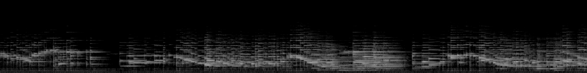
<br/>
<audio src="uncond_piano_mp3/1.mp3" controls ></audio>
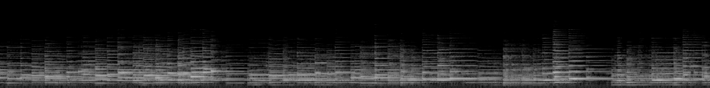
<br/>
<audio src="uncond_piano_mp3/2.mp3" controls ></audio>
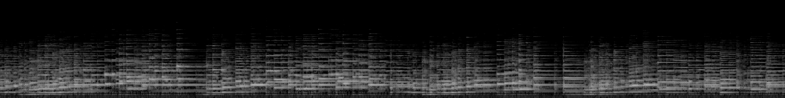
<br/>
<audio src="uncond_piano_mp3/3.mp3" controls ></audio>
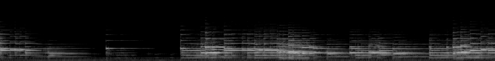
<br/>
<audio src="uncond_piano_mp3/4.mp3" controls ></audio>
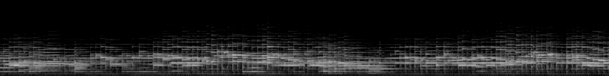
<br/>
<audio src="uncond_piano_mp3/5.mp3" controls ></audio>
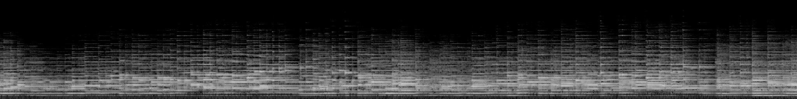
<br/>
<audio src="uncond_piano_mp3/6.mp3" controls ></audio>
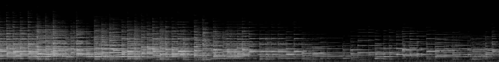
<br/>
<audio src="uncond_piano_mp3/7.mp3" controls ></audio>
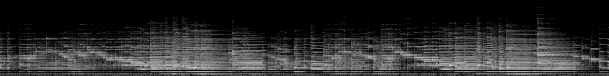
<br/>
<audio src="uncond_piano_mp3/8.mp3" controls ></audio>
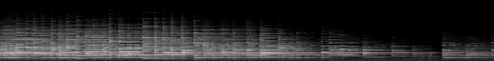
<br/>
<audio src="uncond_piano_mp3/9.mp3" controls ></audio>
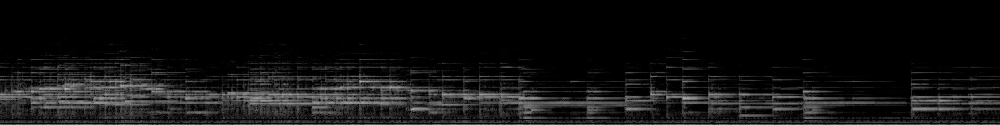

### 4 minutes samples
<br/>
<audio src="uncond_piano_mp3/long/0.mp3" controls ></audio>
<audio src="uncond_piano_mp3/long/1.mp3" controls ></audio>
<audio src="uncond_piano_mp3/long/2.mp3" controls ></audio>
<audio src="uncond_piano_mp3/long/3.mp3" controls ></audio>
<audio src="uncond_piano_mp3/long/4.mp3" controls ></audio>
<audio src="uncond_piano_mp3/long/5.mp3" controls ></audio>

### UNAGAN samples for comparison
<br/>
<audio src="unagan_piano_23/0.mp3" controls ></audio>
<audio src="unagan_piano_23/1.mp3" controls ></audio>
<audio src="unagan_piano_23/2.mp3" controls ></audio>
<audio src="unagan_piano_23/3.mp3" controls ></audio>  
<br/>
<audio src="unagan_piano_237/0.mp3" controls ></audio>
<audio src="unagan_piano_237/1.mp3" controls ></audio>
<audio src="unagan_piano_237/2.mp3" controls ></audio>
<audio src="unagan_piano_237/3.mp3" controls ></audio>


## Conditional Piano Music Generation

We use the [MADMOM](https://github.com/CPJKU/madmom) Python library to perform onset detection for each sample in the MAESTRO dataset. We then create a note density signal and use it as conditioning for latent GAN. This allows users to interact with the generation process by proposing a custom note density signal.  
As a demonstration, we showcase generated samples created by both feeding random signals and using constant values as note density conditioning.

### Random Note Density
<br/>
<audio src="cond_piano_mp3/0.mp3" controls ></audio>

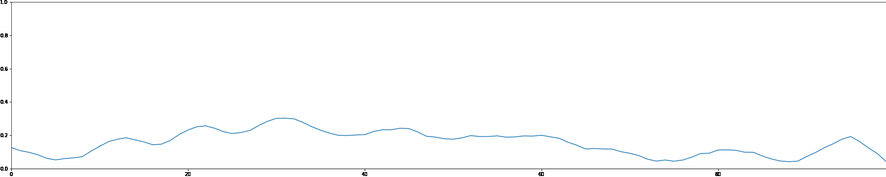
<br/>
<audio src="cond_piano_mp3/1.mp3" controls ></audio>
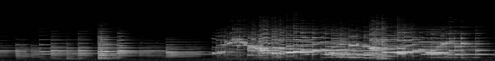
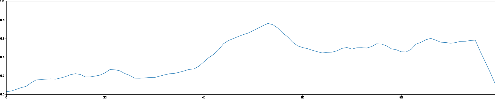
<br/>
<audio src="cond_piano_mp3/2.mp3" controls ></audio>
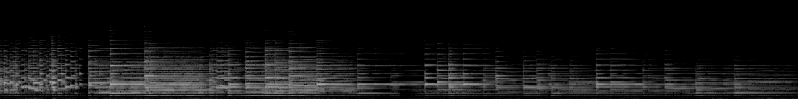

<br/>
<audio src="cond_piano_mp3/3.mp3" controls ></audio>
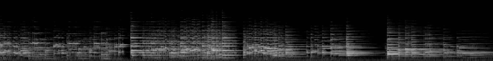
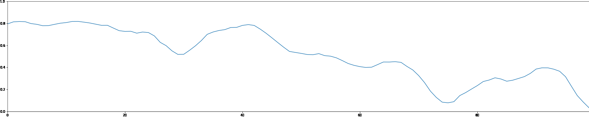
<br/>
<audio src="cond_piano_mp3/4.mp3" controls ></audio>
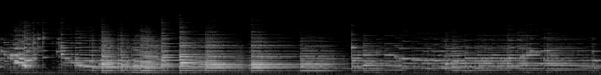
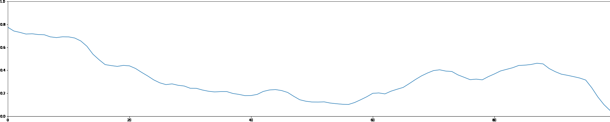
<br/>
<audio src="cond_piano_mp3/5.mp3" controls ></audio>
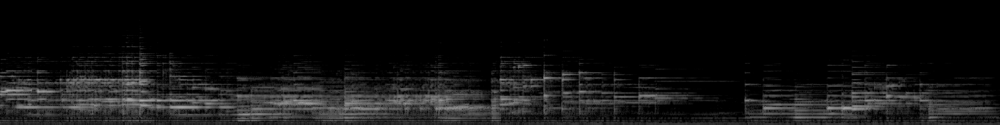
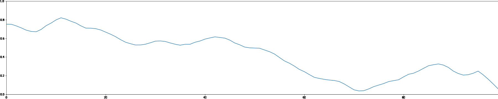
<br/>
<audio src="cond_piano_mp3/6.mp3" controls ></audio>
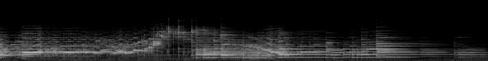
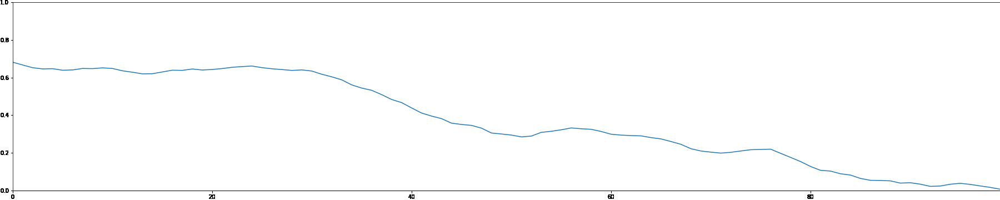

### Constant Note Density
<br/>
<audio src="cond_piano_mp3/7.mp3" controls ></audio>
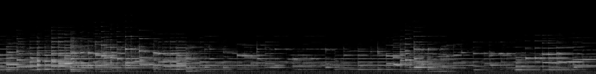
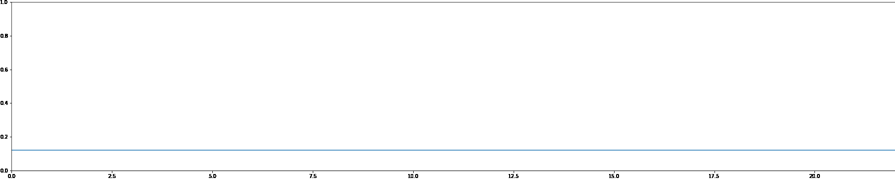
<br/>
<audio src="cond_piano_mp3/8.mp3" controls ></audio>
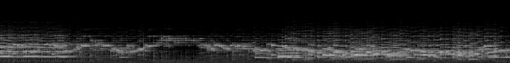
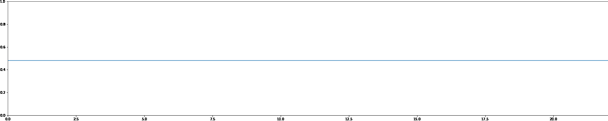
<br/>
<audio src="cond_piano_mp3/9.mp3" controls ></audio>
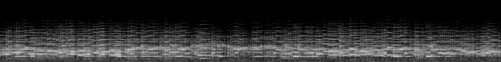
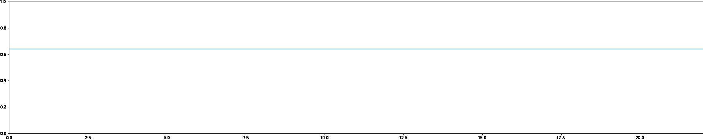
<br/>
<audio src="cond_piano_mp3/10.mp3" controls ></audio>
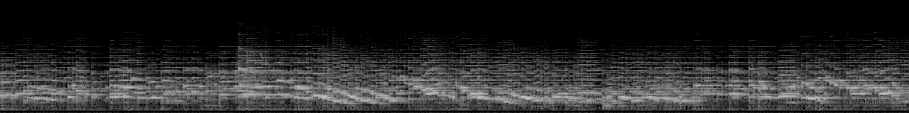
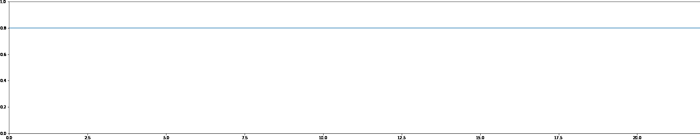


<!-- ## Welcome to GitHub Pages

You can use the [editor on GitHub](https://github.com/anonymous2732/anonymous2732.github.io/edit/main/index.md) to maintain and preview the content for your website in Markdown files.

Whenever you commit to this repository, GitHub Pages will run [Jekyll](https://jekyllrb.com/) to rebuild the pages in your site, from the content in your Markdown files.

### Markdown

Markdown is a lightweight and easy-to-use syntax for styling your writing. It includes conventions for

```markdown
Syntax highlighted code block

# Header 1
## Header 2
### Header 3

- Bulleted
- List

1. Numbered
2. List

**Bold** and _Italic_ and `Code` text

[Link](url) and 
```

For more details see [Basic writing and formatting syntax](https://docs.github.com/en/github/writing-on-github/getting-started-with-writing-and-formatting-on-github/basic-writing-and-formatting-syntax).

### Jekyll Themes

Your Pages site will use the layout and styles from the Jekyll theme you have selected in your [repository settings](https://github.com/anonymous2732/anonymous2732.github.io/settings/pages). The name of this theme is saved in the Jekyll `_config.yml` configuration file.

### Support or Contact

Having trouble with Pages? Check out our [documentation](https://docs.github.com/categories/github-pages-basics/) or [contact support](https://support.github.com/contact) and we’ll help you sort it out.
 -->
